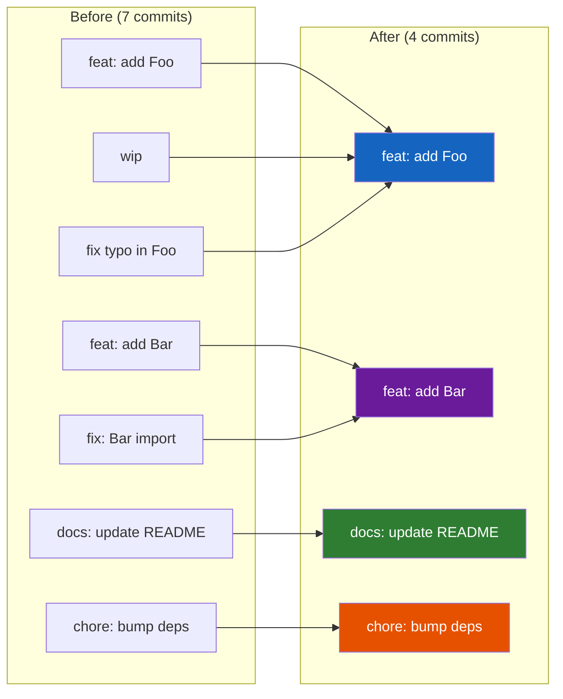
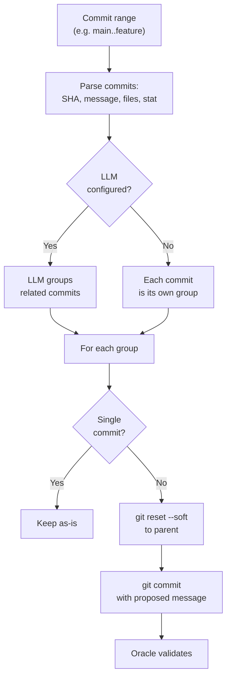

# Phase 1: Consolidation

**Module**: `consolidate.smart-squash`

Phase 1 groups related commits and squashes each group while preserving chronological
order. This reduces noise before Phase 2 (unfold) decomposes the remaining large
commits.

## Why not squash everything?

Original commit boundaries carry intent signal. A developer who made 5 commits had
reasons for each boundary --- even if the messages are "wip" and "fix typo". Squashing
everything into one blob destroys information that makes Phase 2 easier.

Smart-squash preserves signal by only grouping commits that genuinely belong together:



## Pipeline



## Commit parsing

**Function**: `parse-commit-range(dir, ref-range)`

Extracts metadata from each commit in the range:

```clojure
{:sha     "abc123"
 :message "wip: trying something"
 :files   ["src/Foo.hs" "src/Bar.hs"]
 :stat    "+20 -5"}
```

Uses three git commands per commit:

| Command | Extracts |
|---------|----------|
| `git log --format=%H\|%s --reverse` | SHA and message |
| `git diff-tree --no-commit-id -r --name-only` | Changed files |
| `git diff --stat sha~1..sha` | Insertions/deletions summary |

## LLM grouping

**Function**: `group-commits(llm-fn, commits)`

The LLM receives all commits with their metadata and returns groupings:

### Request

```json
{
  "system": "You are a commit history analyst...",
  "commits": [
    {"sha": "abc123", "message": "wip", "files": [...], "stat": "+20 -5"},
    {"sha": "def456", "message": "fix typo", "files": [...], "stat": "+1 -1"}
  ]
}
```

### Response

```json
{
  "groups": [
    {
      "shas": ["abc123", "def456"],
      "reason": "Both touch Foo.hs, second fixes typo in first",
      "proposed_message": "feat: add Foo module"
    }
  ]
}
```

### Grouping patterns the LLM identifies

| Pattern | Example | Action |
|---------|---------|--------|
| Commit + fixup | "add Foo" + "fix Foo import" | Squash |
| WIP sequence | "wip" + "wip2" + "still wip" | Squash, use final meaningful message |
| Same concern | Two commits both adding to Bar | Squash |
| Independent | Unrelated changes | Keep separate |

## Squashing

**Function**: `squash-group(dir, shas, message)`

For groups with multiple commits:

1. `git reset --soft <parent-of-first>` --- unstages all commits but keeps changes
2. `git commit -m "<proposed_message>"` --- creates single commit with group's changes

Order within the group is preserved by the chronological SHA ordering, and since all
changes are soft-reset and recommitted together, the result is equivalent to applying
them sequentially.

## Without LLM

When no LLM is configured, each commit becomes its own group (no squashing). The
tool degrades gracefully --- Phase 2 still works on individual commits.

## Output

Consolidation returns the grouping plan for review:

```json
{
  "groups": [...],
  "original_count": 7,
  "proposed_count": 4
}
```

The user reviews before applying. In the MCP workflow, `unsquash-consolidate`
returns this plan; a separate call applies it.
