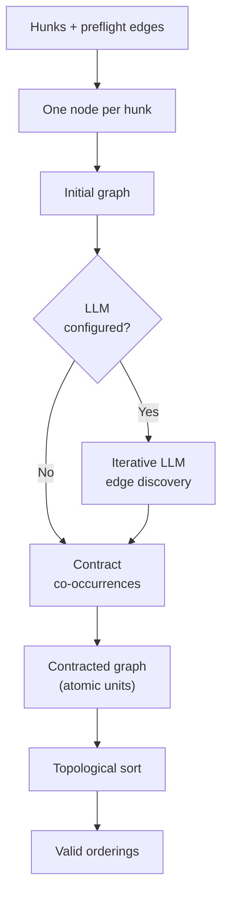
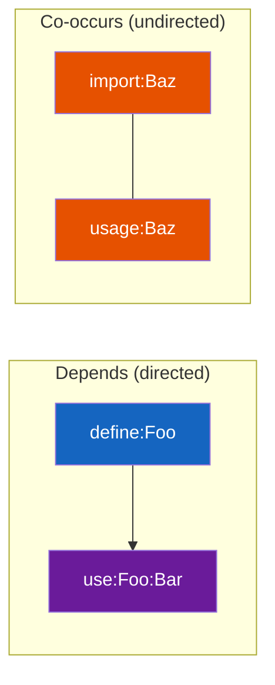
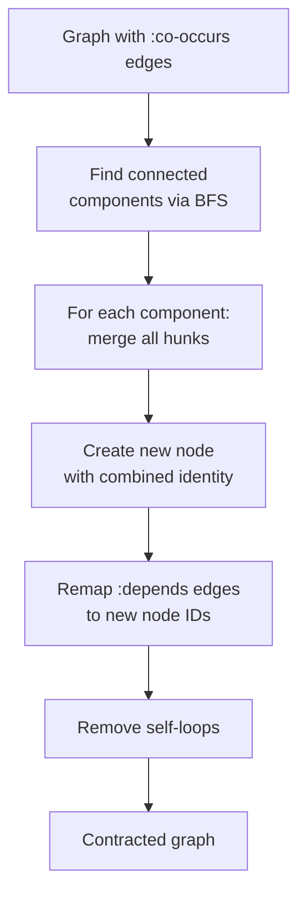
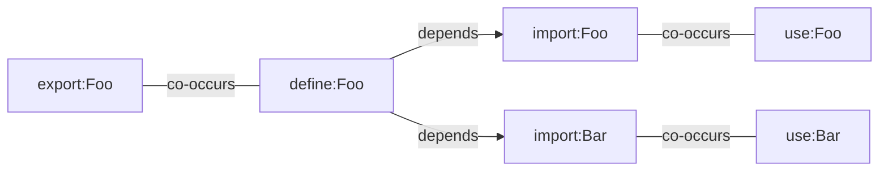

# Dependency Graph

**Module**: `core.graph`

The dependency graph is unsquash's core data structure. Nodes represent atomic units
of change; directed edges represent ordering constraints. The graph determines which
commit sequences are valid.

## Graph construction



### Initial graph

The initial graph has one node per hunk and edges from the preflight rules:

```clojure
(make-graph
  (mapv #(make-atomic-unit (:id %) (:id %) #{%}) hunks)
  (set preflight-edges))
```

Each node wraps a single hunk with an identity string. The graph is represented as:

```clojure
{:nodes {id -> AtomicUnit}
 :edges #{Edge ...}}
```

### LLM refinement

If an LLM is configured, `llm.classifier/run-iterative-discovery` adds semantic
edges. The LLM sees the current graph state and proposes new edges each round until
convergence (no new edges) or `max-rounds` is reached.

## Two edge types



**`:depends`** (directed)
: Hunk B needs hunk A applied first. A compiles without B, but B fails without A.
  Example: a function definition must exist before its callers.

**`:co-occurs`** (undirected)
: Hunk A and hunk B are meaningless without each other. Neither compiles alone.
  Example: adding `import Foo (bar)` and using `bar` in the same file.

## Co-occurrence contraction

Before ordering, all co-occurring nodes merge into single **atomic units**. This is
the key transformation --- it reduces the graph from potentially hundreds of fine-grained
hunks to a handful of meaningful change units.

### Algorithm



1. **Find connected components**: BFS over co-occurrence edges. Each component is a
   set of node IDs that must be applied together.

2. **Merge**: For each component, create a new `AtomicUnit` with:
    - Combined hunks (union of all hunks in the component)
    - Combined identity string
    - Original co-occurrence edges stored in `:original-edges`

3. **Remap dependencies**: Every `:depends` edge pointing to/from a node in a
   component gets remapped to the new merged node ID.

4. **Deduplicate and clean**: Remove duplicate edges and self-loops (which arise
   when a dependency pointed between two nodes that got merged).

### Example

Before contraction (6 nodes, mixed edges):



After contraction (3 nodes, only `:depends` edges):


## Topological sorting

### Kahn's algorithm

The standard Kahn's algorithm produces one valid ordering:

1. Build in-degree map (count incoming edges per node)
2. Initialize queue with all zero-in-degree nodes
3. While queue non-empty:
    - Dequeue a node, append to result
    - For each outgoing edge, decrement target's in-degree
    - If target reaches zero, enqueue it
4. If all nodes visited: return ordering. Otherwise: **cycle detected**.

### All topological sorts

`all-toposorts(graph, max-n)` generates up to `max-n` distinct valid orderings using
backtracking:

- At each step, all nodes with in-degree 0 are candidates
- Try each candidate, recurse with updated in-degrees
- Collect orderings until `max-n` reached

This is exponential in the worst case but bounded by `max-n` (typically 3--10).

### Why multiple orderings matter

Different topological sorts produce different commit narratives:

| Ordering strategy | Story |
|-------------------|-------|
| New types first | "Add the foundation, then build on it" |
| Wiring first | "Set up the plumbing, then add the features" |
| By module | "Complete module A, then module B" |

The user reviews the orderings and picks the one that best serves reviewers.

## Cycle detection

If `toposort` returns `nil`, the graph has cycles --- no valid ordering exists. This
indicates contradictory edges (A depends on B, B depends on C, C depends on A).

Cycles can arise from:

- Incorrect LLM edge proposals (most common)
- Mutual recursion patterns in the diff
- Preflight rule false positives

The `has-cycles?` predicate allows early detection before attempting to compute
orderings.
