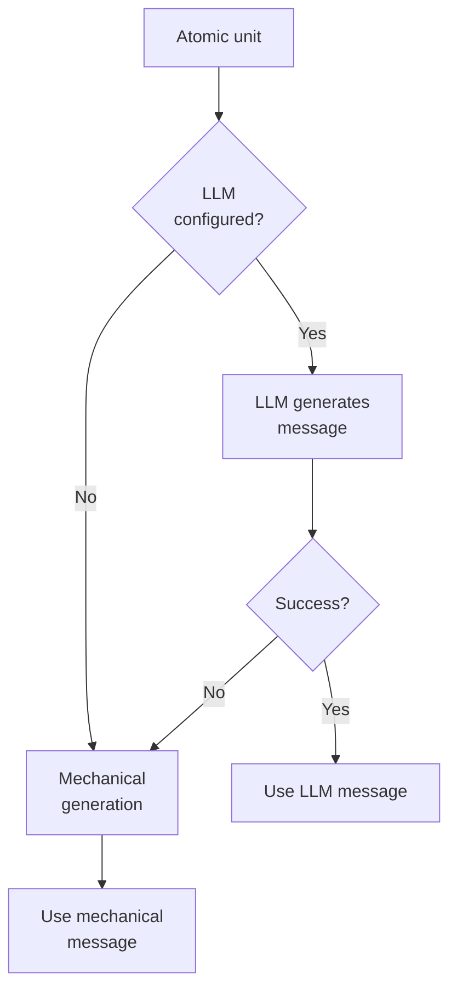

# Commit Message Generation

**Module**: `core.message`

Every atomic unit needs a commit message. unsquash generates messages mechanically
from diff content, with an optional LLM upgrade path for richer descriptions.

## Two paths



## Mechanical generation

**Function**: `generate-message(hunks, identity-str)`

The mechanical generator analyzes diff content to produce Conventional Commits messages
without any LLM call.

### Change type detection

**Function**: `detect-change-type(hunks)`

| Condition | Type | Example |
|-----------|------|---------|
| New source file | `feat` | `feat: add Foo.Bar` |
| New test file | `test` | `test: add Foo.Bar specs` |
| All deletions | `refactor` | `refactor: remove unused Baz` |
| Test files only | `test` | `test: update test helpers` |
| Docs files only | `docs` | `docs: update README` |
| CI files only | `ci` | `ci: update workflow` |
| Cabal/config only | `chore` | `chore: update cabal configuration` |
| Default | `refactor` | `refactor: update func in module` |

### Content extraction

Four extractors analyze the hunks:

**`extract-module-names`**
: Parses `^module Name` declarations from new files. Used for `feat: add Module.Name`
  messages.

**`extract-added-imports`**
: Parses `import Mod` from add-lines. Used for `feat: import Mod1, Mod2 in file1`.

**`extract-changed-functions`**
: Finds function names appearing in both add and remove lines (modified functions).
  Used for `refactor: update func1, func2 in file`.

**`summarize-files`**
: Compact file list: up to 2 named files, then "file and N more". Keeps messages
  concise.

### Message format

All messages follow Conventional Commits:

```
<type>: <description>
```

Examples:

| Diff content | Generated message |
|-------------|-------------------|
| New module `Foo.Bar` | `feat: add Foo.Bar` |
| New imports in `Baz.hs` | `feat: import Data.Map, Data.Set in Baz` |
| Modified `process`, `validate` | `refactor: update process, validate in Handlers` |
| Cabal file changes | `chore: update cabal configuration` |
| Multiple concerns | `refactor: update func1, func2 et al in file1, file2` |

## LLM generation

**Function**: `generate-message-llm(llm-fn, diff-text, files)`

When an LLM is configured, it receives a structured request with the diff content
and file list, and returns a contextually richer message.

### Request format

```clojure
{:system "You are a commit message generator..."
 :prompt "Generate a conventional commit message for this change..."
 :diff diff-text
 :files ["src/Foo.hs" "src/Bar.hs"]
 :response_schema {:type "object"
                   :properties {:message {:type "string"}}}}
```

### Fallback

If the LLM call fails (timeout, parse error, empty response), the mechanical
generator produces the message. This ensures every commit always gets a message,
regardless of LLM availability.

## Integration with the sequencer

The `apply-atomic-unit` function passes `llm-fn` through to message generation:

```clojure
(let [message (or (when llm-fn
                    (msg/generate-message-llm llm-fn diff-preview files))
                  (msg/generate-message hunks (:identity unit)))]
  ...)
```

The LLM sees a compact diff preview (file, line range, add/remove counts) rather
than the full patch --- keeping the prompt focused and within token limits.
