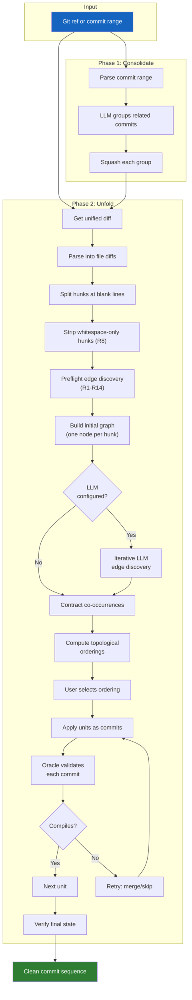
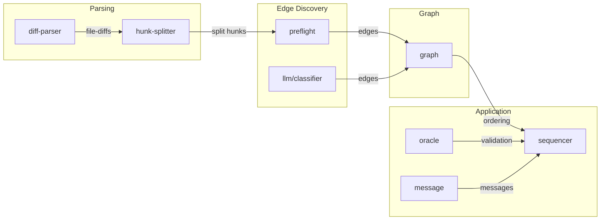

# Algorithm Overview

unsquash transforms messy commit histories into clean, dependency-ordered commit
sequences. The algorithm is language-agnostic by default and operates in two phases.

## Full pipeline

## Data flow through modules

## Phase 1: Consolidate

Smart-squash preserves the intent signal from original commit boundaries. Instead of
squashing everything into one blob (which destroys information), the LLM identifies
groups that belong together:

| Pattern | Action |
|---------|--------|
| Commit + its fixup | Squash into one |
| WIP + continuation | Squash, use final message |
| Same-concern pair | Squash, generate new message |
| Independent commit | Keep as-is |

Order within groups is preserved, guaranteeing compilability. See
[Consolidation](consolidation.md) for details.

## Phase 2: Unfold

The core algorithm. Given a single (possibly large) commit, decompose it into a
sequence of focused, compile-validated commits.

### Step 1: Parse and split

The unified diff is parsed into structured hunks, then each hunk is split at blank-line
boundaries to maximize atomicity. Git's diff algorithm often merges unrelated adjacent
changes into one hunk --- splitting recovers the natural boundaries.

See [Diff Parsing](parsing.md).

### Step 2: Preflight edge discovery

Fourteen mechanical rules (R1--R14) detect relationships between hunks without any LLM
involvement. These rules exploit diff structure, not code semantics:

- **Co-occurrence** (`:co-occurs`): hunks that are meaningless without each other
- **Dependency** (`:depends`): hunk B needs hunk A applied first

See [Preflight Rules](preflight.md).

### Step 3: Build and refine graph

Hunks become nodes, edges become the constraints. Co-occurring nodes contract into
**atomic units** --- indivisible groups applied together as one commit.

If an LLM is configured, iterative refinement discovers semantic edges that mechanical
rules miss. The LLM sees the current graph state and proposes new edges until
convergence.

See [Dependency Graph](graph.md).

### Step 4: Compute orderings

The contracted graph is a DAG. Every valid topological sort is a valid commit sequence.
Different orderings tell different stories:

- **Additions first**: new types, then consumers, then wiring
- **Wiring first**: imports and exports, then the code they enable
- **By module**: all changes to module A, then all changes to module B

The user picks the narrative that best serves reviewers.

### Step 5: Apply and validate

The sequencer applies each atomic unit as a git commit, validates with the compile
oracle, and retries on failure (merge with a neighbor or skip). Sequential hunk
application handles overlapping patches from merged units.

See [Sequencer](sequencer.md).

## Invariants

1. **Union preservation**: the union of all atomic units equals the original diff
2. **Compile validation**: every commit in the final sequence passes the oracle
   (except trailing deletions)
3. **Final state match**: the tree SHA after applying all commits matches the original
4. **Acyclicity**: the dependency graph has no cycles (topological sort always exists)
5. **Contraction completeness**: after contraction, no co-occurrence edges remain
   between different nodes
