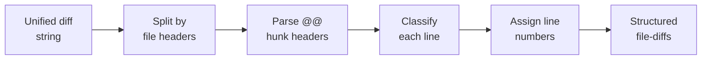
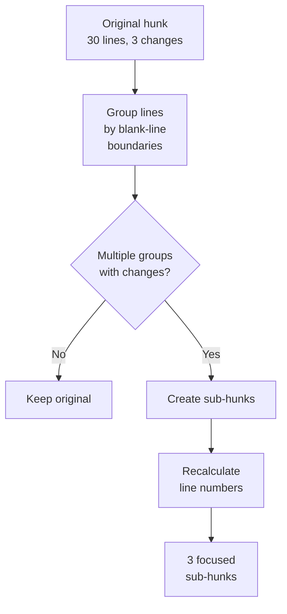

# Diff Parsing and Hunk Splitting

The first stage of the unfold pipeline converts a unified diff string into structured,
fine-grained hunks ready for edge discovery.

## Diff parsing

**Module**: `core.diff-parser`

The parser processes standard unified diff output (`git diff`). It handles both single
commits (`ref~1..ref`) and ranges (`base..head`).



### File header detection

Lines matching `--- a/path` and `+++ b/path` delimit file boundaries. The parser
extracts the file path and groups subsequent hunks under that file.

### Hunk header parsing

Each `@@ -old,count +new,count @@` line starts a new hunk. The parser extracts:

| Field | Meaning |
|-------|---------|
| `old-start` | Starting line in the original file |
| `old-count` | Number of context + removed lines |
| `new-start` | Starting line in the modified file |
| `new-count` | Number of context + added lines |

### Line classification

Every line within a hunk is classified:

| Prefix | Type | Line counter |
|--------|------|-------------|
| `+` | `:add` | Advances new-line counter |
| `-` | `:remove` | Advances old-line counter |
| ` ` | `:context` | Advances both counters |

### Hunk identity

Each hunk gets a unique ID: `file:old-start-old-end`. This ID is stable across
pipeline stages and serves as the node identifier in the dependency graph.

## Diff algorithm selection

Git's default Myers algorithm optimizes for minimal diff size, not semantic meaning.
unsquash supports alternative algorithms via the `--diff-algorithm` flag or
`unsquash.edn` config:

| Algorithm | Behavior | Best for |
|-----------|----------|----------|
| `myers` | Minimal edit distance (default) | Small diffs |
| `patience` | Matches unique lines first | Code with moved blocks |
| `histogram` | Patience variant, faster | Large diffs |

!!! tip "Recommendation"
    Use `patience` or `histogram` for Haskell and other languages where function
    signatures are unique anchors. This produces more semantically meaningful hunk
    boundaries.

## Hunk splitting

**Module**: `core.hunk-splitter`

Git may merge unrelated adjacent changes into a single hunk when they fall within
3 lines of context. The hunk splitter recovers natural boundaries by splitting at
blank lines.



### Algorithm

1. **Group by blank lines**: partition the hunk's lines into segments separated by
   blank lines (empty or whitespace-only). The blank line stays with the preceding
   group.

2. **Filter for changes**: keep only groups containing at least one `:add` or
   `:remove` line.

3. **Decision**:
    - 0--1 groups with changes: return the hunk unchanged
    - 2+ groups: create sub-hunks

4. **Recalculate headers**: for each sub-hunk, recompute `old-start`, `old-count`,
   `new-start`, `new-count` from the actual line types in the group. Assign a new
   ID based on the recalculated range.

### Why blank lines?

Blank lines are the universal structural boundary in code. They separate functions,
type declarations, import groups, and logical sections. Splitting here produces hunks
that correspond to single logical changes --- much better units for dependency analysis.

### Example

A hunk containing an import addition at line 5 and a function change at line 25
(merged by git because there happen to be fewer than 3 blank lines between context
regions) becomes two sub-hunks:

```
Sub-hunk 1: import addition (lines 3-7)
Sub-hunk 2: function change (lines 22-28)
```

Each can now be independently classified and ordered.

### Effective hunks

The `effective-hunks` function returns sub-hunks when splitting occurred, otherwise
the original hunk. Downstream stages always call this to get the finest available
granularity.
