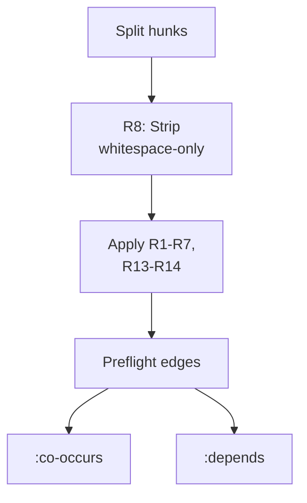
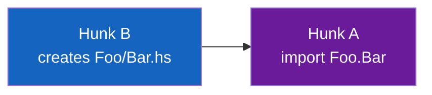

# Preflight Rules

**Module**: `core.preflight`

Preflight rules are deterministic, mechanical edge-discovery rules that work on any
unified diff without LLM involvement. They form Layer 1 of the three-layer edge
discovery system.

## Rule summary



!!! info "Universal vs. profile-driven rules"
    Rules marked **profile** require a [language profile](../reference/language-profiles.md)
    to fire. Without a profile, only **universal** rules run. Profiles are auto-detected
    from file extensions or set via `:language` in `unsquash.edn`.

| Rule | Name | Edge type | Requires |
|------|------|-----------|----------|
| R1 | Export co-occurs with definition | `:co-occurs` | profile |
| R3 | Import superset | `:co-occurs` | profile |
| R4 | Trailing comma | `:co-occurs` | universal |
| R5 | Wildcard count change | `:co-occurs` | profile |
| R6 | Systematic removal | `:co-occurs` | universal |
| R8 | Whitespace-only | (strip) | universal |
| R13 | Cross-file import | `:depends` | profile |
| R14 | Manifest module registration | `:co-occurs` | profile |

## Rule details

### R1: Export co-occurs with definition

When hunk A adds a name to an export/visibility list and hunk B defines that name
(in the same file), they must be applied together.

**Detection**: Regex match for `^name\s` patterns in add-lines of the definition
hunk, cross-referenced with export-list additions in the other hunk.

**Example**:
```diff
# Hunk A (export list)
+  updateTreasuryDonation,

# Hunk B (function definition)
+updateTreasuryDonation :: DonationAmount -> ...
+updateTreasuryDonation amount = ...
```

Edge: `A <-> B :co-occurs "export enables definition visibility"`

---

### R3: Import superset

When a hunk replaces imports with a superset (removes some, adds more) AND another
hunk uses the newly imported names, the import and usage hunks co-occur.

**Detection**: Compare removed import names vs. added import names. Check if new
names appear in other hunks' add-lines.

**Example**:
```diff
# Hunk A (import change)
-import Data.Map (Map)
+import Data.Map (Map, lookup, insert)

# Hunk B (usage)
+  result = lookup key (insert k v m)
```

Edge: `A <-> B :co-occurs "import enables usage"`

---

### R4: Trailing comma

A hunk that only changes a line by appending a comma is a formatting artifact of
adding a new item to a list. It co-occurs with itself (indicating it's part of a
larger change).

**Detection**: Exactly 1 remove line, 1+ add lines. The first add equals the remove
with a trailing comma appended.

**Example**:
```diff
-  alonzoToConwayUtxoPredFailure
+  alonzoToConwayUtxoPredFailure,
+  newPredFailure
```

---

### R5: Wildcard count change

When a pattern match changes its wildcard (`_`) count AND another hunk adds record
fields, the pattern adjustment co-occurs with the field addition.

**Detection**: Both old and new patterns have >2 underscores. The count differs.
The rest of the line matches modulo whitespace.

**Example**:
```diff
# Hunk A (pattern match)
-  Foo _ _ _ -> bar
+  Foo _ _ _ _ -> bar

# Hunk B (record field)
+  , newField :: Int
```

Edge: `A <-> B :co-occurs "wildcard adjustment pairs with field addition"`

---

### R6: Systematic removal

When 3+ hunks remove identical import/constraint patterns across different files,
they represent a systematic cleanup and should be applied together.

**Detection**: Group removal-only hunks by their content pattern. Require 3+ hunks
across 2+ distinct files.

**Example**: Removing `import Debug.Trace` from 5 different modules --- all 5 hunks
co-occur.

---

### R8: Whitespace-only (strip)

Hunks where every add/remove pair differs only in whitespace carry no semantic
content and are stripped before classification.

**Detection**: For each remove/add pair, check if content is identical after
collapsing whitespace.

!!! note
    R8 hunks are filtered out entirely. They don't appear in the dependency graph.

---

### R13: Cross-file import dependency

When hunk A adds `import Foo.Bar` and hunk B creates the new file `Foo/Bar.hs`,
then A depends on B --- the import can't exist until the module file does.

**Detection**: Extract module path from file path (`src/Foo/Bar.hs` becomes
`Foo.Bar`). Match against import declarations in other hunks' add-lines.



Edge: `A -> B :depends "import depends on module file"`

---

### R14: Cabal module registration

When a cabal file hunk adds a module name to `exposed-modules` and another hunk
creates that module's file, they co-occur --- both are needed for the module to be
visible to consumers.

**Detection**: Parse module names from cabal `exposed-modules` additions. Match
against new file paths using the same module-to-path mapping as R13.

Edge: `cabal-hunk <-> file-hunk :co-occurs "cabal registration pairs with module creation"`

## Edge data structure

Every preflight edge carries metadata:

```clojure
{:from       "src/Foo.hs:42-50"      ; source hunk ID
 :to         "src/Bar.hs:10-15"      ; target hunk ID
 :kind       :co-occurs              ; or :depends
 :reason     "export enables usage"  ; human-readable
 :confidence :preflight              ; mechanical, not LLM
 :rule       "R1"}                   ; which rule fired
```

## Whitespace filtering

Two utility functions support the R8 workflow:

- `whitespace-only-hunks(hunks)` --- returns hunks matching R8
- `non-whitespace-hunks(hunks)` --- returns hunks NOT matching R8

The pipeline calls `non-whitespace-hunks` early to strip noise before edge discovery.
