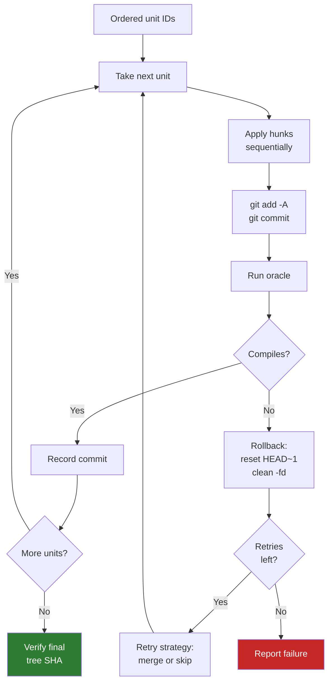
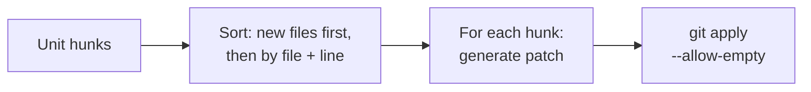
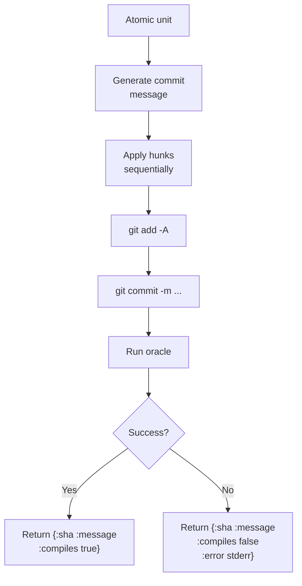
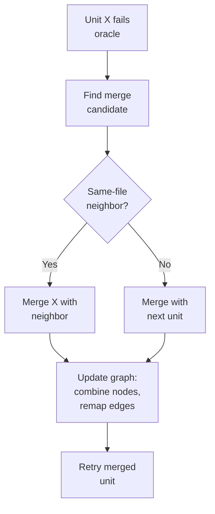

# Sequencer

**Module**: `core.sequencer`

The sequencer takes a topological ordering and applies each atomic unit as a git
commit, validating with the compile oracle and retrying on failure.

## Apply ordering



### Signature

```clojure
(apply-ordering ordering graph oracle-fn dir original-tree-sha
  & {:keys [max-retries retry-fn llm-fn] :or {max-retries 3}})
```

| Parameter | Description |
|-----------|-------------|
| `ordering` | Sequence of atomic unit IDs (topological order) |
| `graph` | The contracted dependency graph |
| `oracle-fn` | Compile validation function |
| `dir` | Working directory |
| `original-tree-sha` | Expected tree SHA after all commits |
| `max-retries` | Maximum retry attempts (default: 3) |
| `retry-fn` | Custom retry strategy (default: merge with neighbor) |
| `llm-fn` | Optional LLM for commit message generation |

### Return value

```clojure
{:commits [{:sha "abc123"
            :message "feat: add Foo.Bar"
            :compiles true}
           ...]
 :final-state-matches true
 :retries 1}
```

## Sequential hunk application

**Function**: `apply-hunks-sequentially`

Rather than generating a single patch for all hunks in a unit, the sequencer applies
each hunk individually via `git apply`. This handles merged units where hunks from
the same file may have overlapping line ranges.



**Sort order**: New file hunks (detected by `--- /dev/null` header) are applied first
since they create the file. Remaining hunks are sorted by file path and old-start line
to maintain natural application order.

## Applying a single unit

**Function**: `apply-atomic-unit`



**Message generation priority**:

1. LLM-generated message (if `llm-fn` provided)
2. Mechanical message from `core.message/generate-message`

If a hunk fails to apply (e.g., patch conflict), the function cleans up with
`git checkout -- .` and `git clean -fd`, then returns a failure result.

## Retry strategy

When a commit fails oracle validation, the sequencer rolls back and decides how to
recover.

### Default: merge strategy



**`find-merge-candidate`**: Prefers units sharing files with the failed unit (more
likely to resolve the conflict). Falls back to the next unit in the ordering.

**`handle-merge`**: Combines two atomic units:

1. Union their hunks
2. Create a new node with combined identity
3. Remap all edges to the new node ID
4. Remove self-loops
5. Update the remaining ordering

### Skip strategy

If merge doesn't help or the user provides a custom `retry-fn`, a unit can be
skipped entirely (marked `:skipped true`).

### Retry budget

The `max-retries` counter is global across the entire ordering, not per-unit. A
total retry atom tracks attempts. When exhausted, the sequencer reports partial
results.

## Final state verification

After all units are applied, the sequencer compares the working tree's SHA against
the expected `original-tree-sha`:

```clojure
(let [final-tree (git dir "rev-parse" "HEAD^{tree}")]
  {:final-state-matches (= final-tree original-tree-sha)})
```

A mismatch indicates lost or extra changes --- the unfold was not lossless. This is
the ultimate correctness check.

## Simple mode

`apply-ordering-simple` provides the original apply logic without retry:

- Apply each unit in order
- On failure, stop immediately
- No merge/skip strategies

Useful for testing or when the graph is known to be correct.
