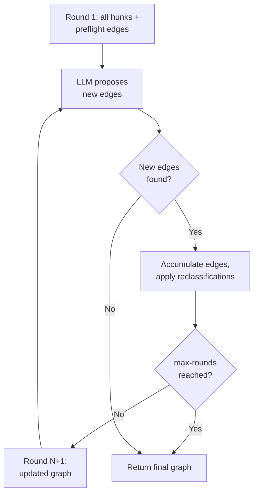
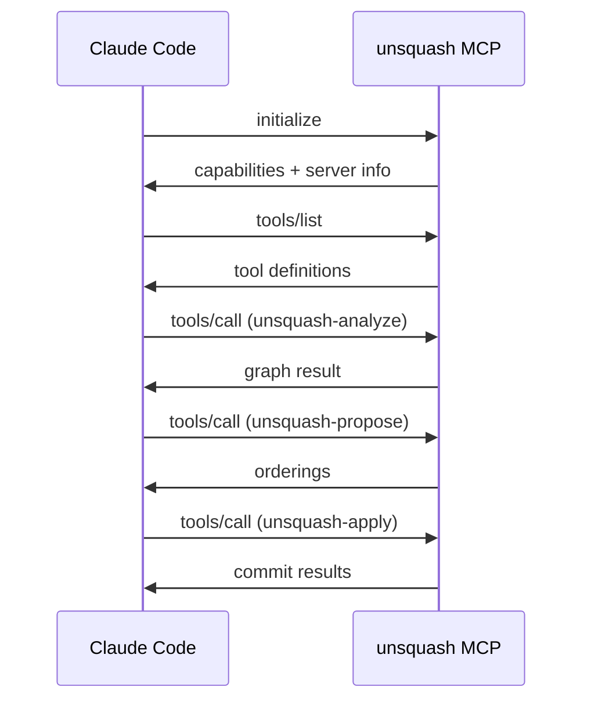

# Contracts

unsquash has three pluggable external interfaces: the LLM CLI, the compile oracle,
and the MCP server. Each is documented here with its request/response formats.

## LLM CLI

**Module**: `llm.classifier`

The LLM is an external process invoked by Babashka. It receives a JSON prompt on
stdin and returns structured JSON on stdout.

### Invocation

```
<llm-command> [args from config]
```

Exit code 0 = success. Any non-zero exit = failure (triggers fallback).

### Edge discovery request

```json
{
  "system": "You are a code change classifier...",
  "prompt": "Given these hunks and the current graph state, discover edges...",
  "hunks": [
    {
      "id": "src/Foo.hs:42-50",
      "file": "src/Foo.hs",
      "diff": "- old line\n+ new line",
      "context": "surrounding code for understanding"
    }
  ],
  "existing_edges": [
    {"from": "h1", "to": "h2", "kind": "co-occurs", "reason": "..."}
  ],
  "existing_units": [
    {"id": "u1", "identity": "define:Foo", "hunk_ids": ["h1", "h3"]}
  ],
  "response_schema": { "..." : "..." }
}
```

### Edge discovery response

```json
{
  "edges": [
    {"from": "h5", "to": "h1", "kind": "depends",
     "reason": "h5 uses type Foo defined in h1"},
    {"from": "h6", "to": "h5", "kind": "co-occurs",
     "reason": "h6 is the import enabling h5's usage of Foo"}
  ],
  "reclassifications": [
    {"hunk_id": "h7", "new_unit": "define:Foo",
     "reason": "h7 is part of the Foo definition, not separate"}
  ]
}
```

### Iterative refinement

The LLM is called in rounds via `run-iterative-discovery`:



- **Convergence**: stops when a full round produces zero new edges or reclassifications
- **Max rounds**: configurable via `unsquash.edn` (default: 4)
- **Timeout**: 60 seconds per LLM call

### Intermediate state synthesis

For hunks at the intersection of two atomic units, the LLM can split them:

```json
{
  "system": "You are a code rewriter...",
  "hunk": {"id": "...", "diff": "..."},
  "unit_a": {"identity": "use:Bar:Foo"},
  "unit_b": {"identity": "api-change:process:new-arg"},
  "order": "unit_a first, then unit_b"
}
```

Response:

```json
{
  "hunk_a": "diff content for unit A (applied first)",
  "hunk_b": "diff content for unit B (applied second)",
  "explanation": "Split type adoption from API change"
}
```

### Commit message request

```json
{
  "system": "You are a commit message generator...",
  "diff": "compact diff preview",
  "files": ["src/Foo.hs", "src/Bar.hs"],
  "response_schema": {
    "type": "object",
    "properties": {"message": {"type": "string"}}
  }
}
```

### Consolidation grouping request

```json
{
  "system": "You are a commit history analyst...",
  "commits": [
    {"sha": "abc123", "message": "wip", "files": [...], "stat": "+20 -5"}
  ]
}
```

Response:

```json
{
  "groups": [
    {"shas": ["abc123", "def456"],
     "reason": "Both modify Foo.hs, second fixes typo in first",
     "proposed_message": "feat: add Foo module"}
  ]
}
```

## Compile oracle

**Module**: `oracle.compile`

The compile oracle validates that the working tree compiles after each commit.

### Configuration

```edn
{:oracle {:command "cabal build all -O0"
          :timeout 120}}
```

### Invocation

```bash
cd <working-tree> && <command>
```

No arguments. The oracle compiles whatever is in the working tree.

### Response

| Exit code | Meaning |
|-----------|---------|
| 0 | Compilation succeeded |
| non-zero | Compilation failed |

Stderr contains compiler error messages, captured for retry logic.

### Language examples

| Language | Command |
|----------|---------|
| Haskell | `cabal build all -O0` |
| Rust | `cargo check` |
| Go | `go build ./...` |
| TypeScript | `npx tsc --noEmit` |
| Python | `python -m py_compile <files>` |
| Nix | `nix build --quiet` |

### Oracle result structure

```clojure
{:success     true
 :stderr      ""
 :stdout      "Build successful"
 :exit        0
 :duration-ms 3500}
```

### Future: LSP tier

A planned enhancement adds an LSP tier for fast incremental validation during
hunk splitting and synthesis. Since the tool always starts from a compiling state,
LSP diagnostics fire immediately on breakage, enabling tight feedback loops.

## MCP server

**Module**: `mcp.server`

The MCP server exposes unsquash tools via stdio JSON-RPC for Claude Code integration.

### Protocol



### Tool: unsquash-analyze

Build a dependency graph from a commit or range.

**Input**:

| Parameter | Type | Required | Description |
|-----------|------|----------|-------------|
| `ref` | string | yes | Git ref or range |
| `oracle_command` | string | no | Compile oracle command |
| `llm_command` | string | no | LLM CLI command |
| `diff_algorithm` | string | no | `patience`, `histogram`, or `myers` |

**Output**: atomic unit count, edge count, node IDs.

### Tool: unsquash-propose

Compute valid topological orderings.

**Input**:

| Parameter | Type | Required | Description |
|-----------|------|----------|-------------|
| `ref` | string | yes | Git ref to analyze |
| `max_orderings` | integer | no | Maximum orderings (default: 3) |

**Output**: list of orderings, each with sequence, unit identities, and commit messages.

### Tool: unsquash-apply

Apply a chosen ordering as commits.

**Input**:

| Parameter | Type | Required | Description |
|-----------|------|----------|-------------|
| `ref` | string | yes | Git ref to unfold |
| `ordering_index` | integer | yes | Index from propose output |

**Output**: list of commits with SHAs, messages, and compile status; final state match;
retry count.

### Tool: unsquash-consolidate

Smart-squash related commits in a range.

**Input**:

| Parameter | Type | Required | Description |
|-----------|------|----------|-------------|
| `ref` | string | yes | Git ref range |
| `llm_command` | string | no | LLM CLI command |

**Output**: grouping plan with original/proposed commit counts.
