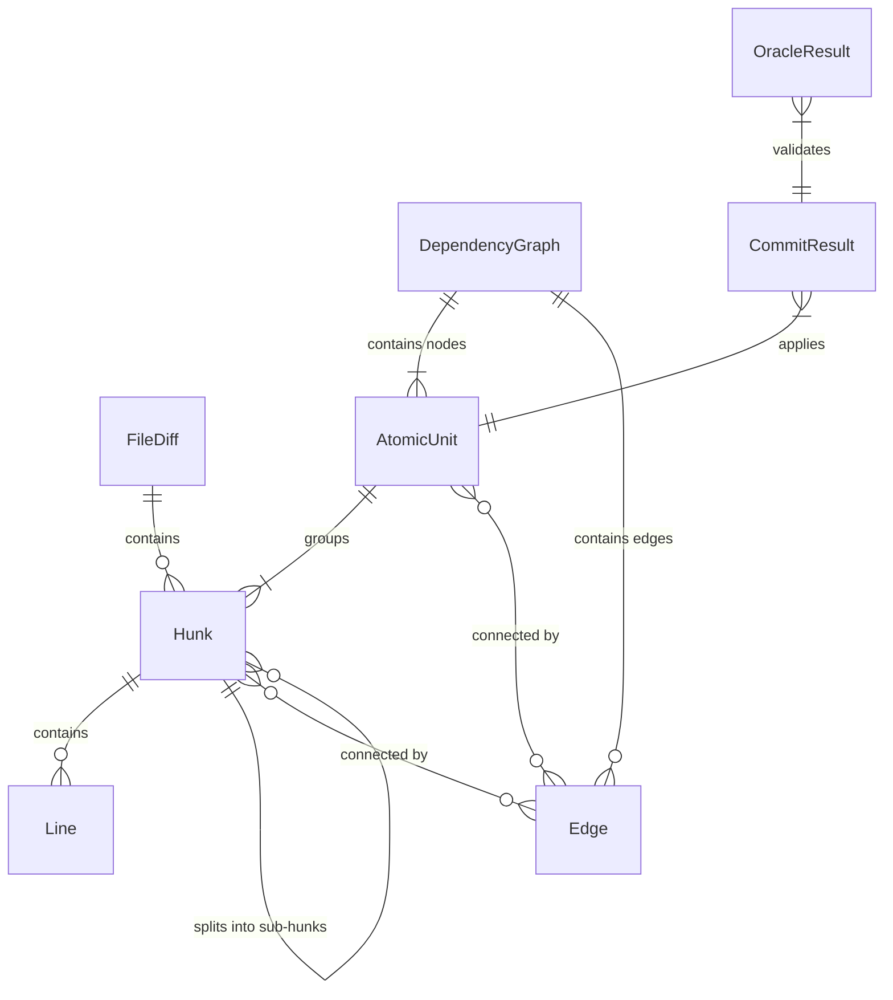
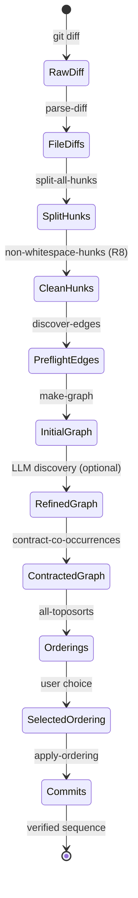

# Data Model

This page documents the core entities, their fields, and relationships as they flow
through the unsquash pipeline.

## Entity relationship diagram

## Entities

### Line

A single diff line within a hunk.

| Field | Type | Description |
|-------|------|-------------|
| `type` | `:context` `:add` `:remove` | Line classification |
| `content` | string | Line text without prefix |
| `old-line-no` | int | Line number in original (`:remove`, `:context`) |
| `new-line-no` | int | Line number in modified (`:add`, `:context`) |
| `line-no` | int | Line number for standalone add/remove |

### Hunk

A contiguous block of changes from a unified diff.

| Field | Type | Description |
|-------|------|-------------|
| `id` | string | Unique ID: `file:old-start-old-end` |
| `file` | string | Path to changed file |
| `old-start` | int | Starting line in original |
| `old-count` | int | Lines in original (context + removed) |
| `new-start` | int | Starting line in modified |
| `new-count` | int | Lines in modified (context + added) |
| `lines` | `[Line]` | Ordered diff lines |
| `sub-hunks` | `[Hunk]` | Result of blank-line splitting (optional) |

### Edge

A relationship between two hunks or atomic units.

| Field | Type | Description |
|-------|------|-------------|
| `from` | string | Source node ID |
| `to` | string | Target node ID |
| `kind` | `:depends` `:co-occurs` | Relationship type |
| `reason` | string | Human-readable rationale |
| `confidence` | `:preflight` `:llm` | Discovery source |
| `rule` | string | Preflight rule ID (e.g. `"R1"`, `"R13"`) |

!!! info "Edge semantics"
    - **`:depends`** is directed: `from` needs `to` applied first
    - **`:co-occurs`** is undirected: both must be applied together

### AtomicUnit

A contracted group of co-occurring hunks --- the fundamental unit of commit creation.

| Field | Type | Description |
|-------|------|-------------|
| `id` | string | Unique identifier |
| `identity` | string | Semantic name (e.g. `"define:Foo"`) |
| `hunks` | set of Hunk | All hunks in this unit |
| `original-edges` | set of Edge | Co-occurrence edges that formed this unit |

### DependencyGraph

The core data structure. A DAG of atomic units connected by dependency edges.

| Field | Type | Description |
|-------|------|-------------|
| `nodes` | `{id -> AtomicUnit}` | All atomic units |
| `edges` | set of Edge | Directed dependency edges |

### CommitResult

The outcome of applying one atomic unit.

| Field | Type | Description |
|-------|------|-------------|
| `sha` | string | Git commit SHA (nil on failure) |
| `message` | string | Commit message used |
| `compiles` | boolean | Oracle validation result |
| `error` | string | Error details (nil on success) |

### OracleResult

The outcome of running the compile oracle.

| Field | Type | Description |
|-------|------|-------------|
| `success` | boolean | Exit code 0 = success |
| `stderr` | string | Compiler error output |
| `stdout` | string | Compiler standard output |
| `exit` | int | Process exit code |
| `duration-ms` | int | Execution time |

## State transitions

The data flows through well-defined stages. Each stage transforms the data into a
more refined form:

## Semantic identities

Atomic units carry semantic identity strings that describe what the unit represents.
These are used in ordering previews and commit messages.

| Pattern | Meaning | Example |
|---------|---------|---------|
| `define:Name` | New definition + visibility wiring | `define:updateTreasuryDonation` |
| `use:Name:File` | Import + usage of Name in File | `use:Foo:Handlers.hs` |
| `api-change:func:desc` | Signature change + callsite updates | `api-change:process:new-arg` |
| `hunk-id` | Single hunk, no co-occurrences | `src/Foo.hs:42-50` |

## Validation rules

These invariants must hold at the end of the pipeline:

1. **Union preservation**: `union(all unit hunks) == original diff hunks`
2. **No cross-unit co-occurrence**: after contraction, no `:co-occurs` edges between
   different nodes
3. **Acyclicity**: the dependency graph is a DAG
4. **Compile validation**: every commit passes the oracle
5. **Final state match**: `tree-sha(HEAD) == tree-sha(original-ref)`
