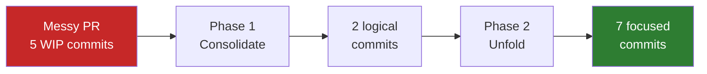

# unsquash

MCP tool that rewrites messy commit histories into clean, reviewable sequences.

## What it does

Given a messy PR (WIP commits, fixups, back-and-forth) or a single squashed commit,
unsquash produces a logically ordered commit sequence where **each commit compiles
independently**.



## Two phases

1. **Consolidate** --- smart-squash related commits preserving order. A commit and its
   fixup become one. WIP noise disappears. Original boundaries carry intent signal ---
   never squash everything first.

2. **Unfold** --- decompose large commits by building a dependency graph of hunks,
   contracting co-occurring changes into atomic units, and computing valid topological
   orderings. Each ordering tells a different story; the user picks.

## Three-layer edge discovery

1. **Preflight** --- mechanical rules (R1--R14) detect obvious relationships without LLM
2. **LLM semantic** --- validate and discover edges based on code understanding
3. **LLM iterative** --- refinement rounds until the graph converges

The compile oracle validates every step.

## Quick start

```bash
# Enter dev shell
nix develop --quiet

# Analyze a single commit
just analyze --ref HEAD --oracle "cabal build all -O0"

# With patience diff algorithm for better hunk boundaries
just analyze --ref HEAD --diff-algorithm patience

# Propose orderings
just propose --max 3

# Apply chosen ordering
just apply --ordering 0

# Full two-phase workflow on a commit range
just consolidate --ref main..feature --llm "llm chat -m claude-sonnet"
```

## MCP integration (Claude Code)

Add to your MCP config:

```json
{
  "mcpServers": {
    "unsquash": {
      "command": "nix",
      "args": ["develop", "--quiet", "--command", "bb", "mcp"],
      "cwd": "/path/to/unsquash"
    }
  }
}
```

Tools: `unsquash-analyze`, `unsquash-propose`, `unsquash-apply`, `unsquash-consolidate`.

## Stack

- **Babashka** --- orchestration, diff parsing, graph construction, git operations
- **LLM CLI** (pluggable) --- semantic edge discovery, commit grouping, intermediate state synthesis
- **Compile oracle** (pluggable) --- per-language build validation (GHC, cargo, go, tsc, etc.)
